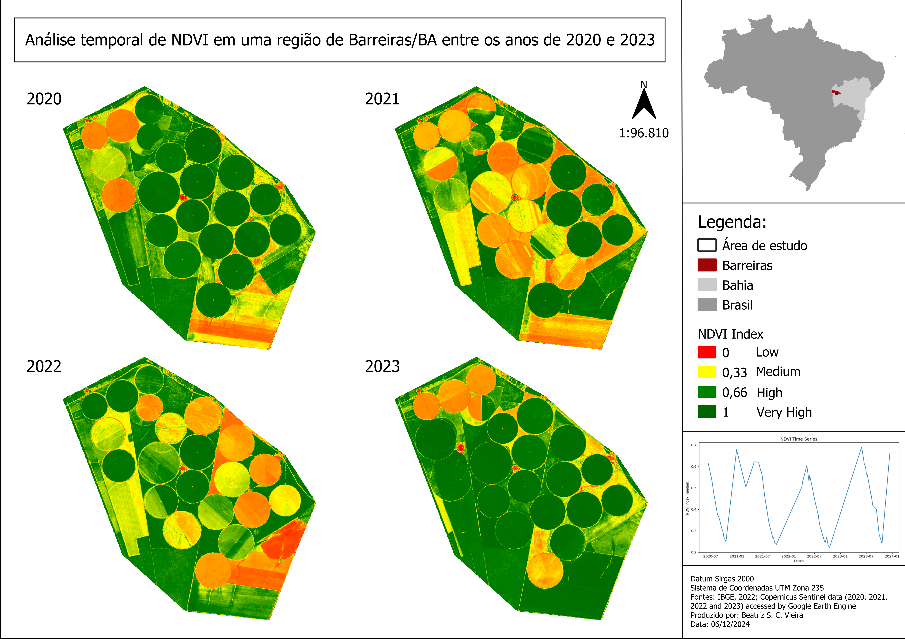
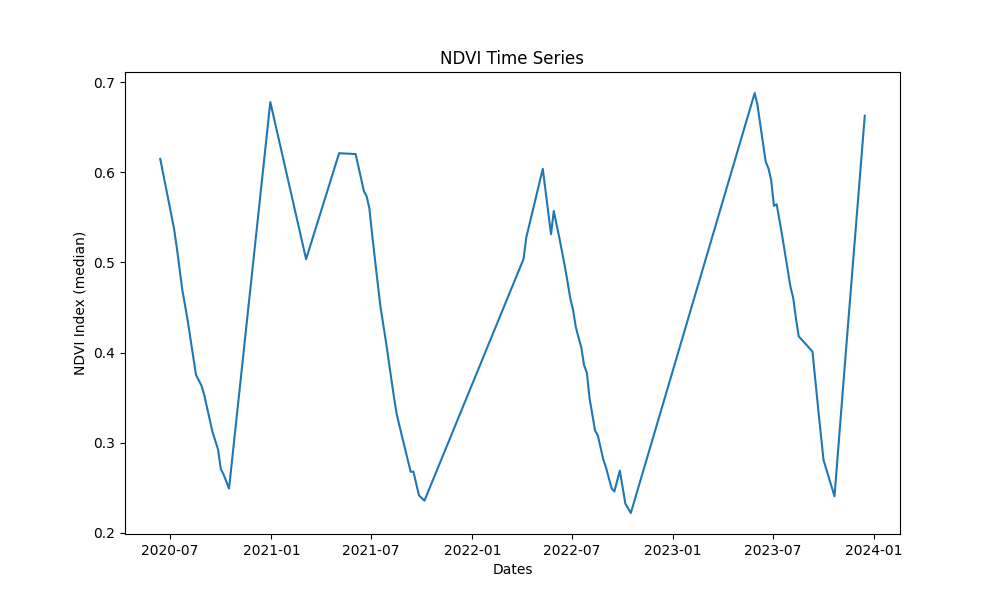
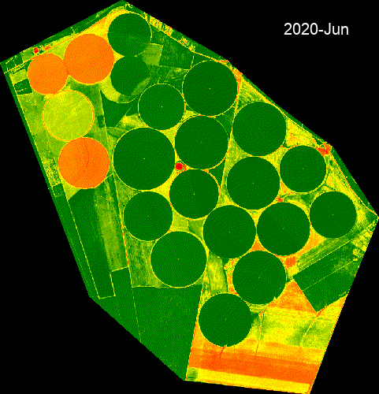

# Análise temporal de NDVI em uma região de Barreiras/BA entre os anos de 2020 e 2023

## 📖 Objetivo do Projeto

* O objetivo deste projeto foi desenvolver um script em Python utilizando a API do Google Earth Engine (GEE) para analisar a variação do NDVI em uma área agrícola do município de Barreiras, na Bahia, durante um período de quatro anos. 

* Com isso, busca-se identificar padrões e possíveis anomalias relacionadas ao comportamento da vegetação ao longo do tempo, contribuindo para o entendimento da dinâmica agrícola local.

## 🌱 Índice de Vegetação por Diferença Normalizada (NDVI)

* O NDVI (Normalized Difference Vegetation Index) é uma métrica amplamente utilizada para medir a saúde da vegetação com base na reflectância da luz captada pelas folhas. Ele é calculado pela fórmula: **NDVI = (NIR - Vermelho) / (NIR + Vermelho)**, em que o NIR corresponde ao infravermelho próximo e o Vermelho à luz visível no espectro do vermelho.

* Seus valores variam de -1 a 1, em que números próximos a 1 indicam vegetação saudável e ativa, com alta presença de clorofila, enquanto que valores próximos de 0 ou -1 indicam áreas com plantas não saudáveis ou até sem vegetação, como solo exposto.

## 🌇 Município de Barreiras

* Barreiras está localizado no oeste da Bahia, no bioma Cerrado, e se destaca como um importante polo agrícola e pecuário do estado. 

* O município possui uma área total de 8.051,27 km² e uma população estimada em 159.734 habitantes (IBGE, 2022). 

* Situado em uma região de clima tropical semiúmido (classificação Aw), apresenta uma estação chuvosa de outubro a maio, seguida por um período seco de maio a outubro (ICMBio). 

## 📑 Arquitetura do Projeto
## 🌎 Imagens de Satélite

* Todas as imagens utilizadas no projeto foram obtidas do Google Earth Engine e fazem parte do conjunto de dados "COPERNICUS/S2_SR_HARMONIZED",  do Sentinel-2 Surface Reflectance (Bottom Of Atmosphere), com porcentagem de cobertura de nuvem abaixo de 1%. 

## 📊 Gráfico para Análise Temporal

* O foco inicial foi calcular o NDVI para cada imagem e, posteriormente, determinar a média do índice em cada data. 

* Com esses dados foi criado um gráfico mostrando as variações do NDVI entre 2020 e 2023, possibilitando a análise de padrões e anomalias. 

## 📈 Resultados

* Os resultados do gráfico evidenciaram um padrão no NDVI. 

* Durante os meses de novembro a junho, os valores são elevados, indicando o período de plantio, visto que coincide em certa parte com a estação chuvosa. 

* Já entre julho e outubro, os valores caem, indicando o período de colheita, pois também coincide em certa parte com a estação seca. 

* Foi observada uma anomalia entre março e abril de 2021, quando houve uma redução inesperada no NDVI. Essa queda pode estar associada a fatores como colheitas fora de época, desmatamento ou doenças que afetaram a vegetação.

##  🗺️ Geração das Imagens com NDVI

* Foi desenvolvida uma função para gerar a primeira imagem de cada ano com o índice de vegetação em um mapa interativo.

* Assim, é possível categorizar os valores encontrados em quatro classes: 0 (vegetação deficiente), 0,33 (vegetação moderadamente saudável), 0,66 (vegetação saudável) e 1 (vegetação super saudável). 

* Essas imagens podem ser exportadas como arquivos TIFF para posterior análise em softwares de SIG, como o QGIS. 

## 📱 Criação do GIF

* Também foi criada uma função para gerar um vídeo (GIF) com todas as imagens utilizadas no projeto, sendo possível observar todas alterações da vegetação ao longo dos quatro anos analisados.

## 🚀 Conclusão

* Considero que o objetivo principal foi alcançado com sucesso, proporcionando uma análise temporal e espacial detalhada do comportamento da vegetação agrícola na área de estudo.
 
* A utilização de gráficos e mapas interativos foi fundamental para compreender as dinâmicas das atividades agrícolas na região e identificar possíveis anomalias, fornecendo uma boa base para futuras tomadas de decisão.

## 💡 Melhorias Futuras

* É interessante incorporar outros índices de vegetação, como o EVI (Índice de Vegetação Melhorado).

* Calcular outros parâmetros complementares, como a proporção em porcentagem de cada classe do NDVI nas imagens analisadas. 

* Essas melhorias oferecem informações ainda mais detalhadas para a tomada de decisão.

## 🧪 Testes e Reprodutibilidade

* Para garantir a fidelidade na reprodução do projeto é preciso seguir algumas etapas fundamentais:

* Clone o repositório do projeto em sua máquina. 

* Crie um ambiente virtual para isolar o projeto e evitar conflitos de dependências com outros projetos existentes.

* Instale todas as bibliotecas utilizadas no projeto, que estão listadas no arquivo **requeriments.txt**. Isso pode ser feito de forma simples utilizando o comando **pip install -r requirements.txt** no terminal. 

* Para utilizar a API do Google Earth Engine é necessário criar uma conta no Google Cloud Platform (GCP), configurar um novo projeto e obter as credenciais necessárias para autenticação. 
